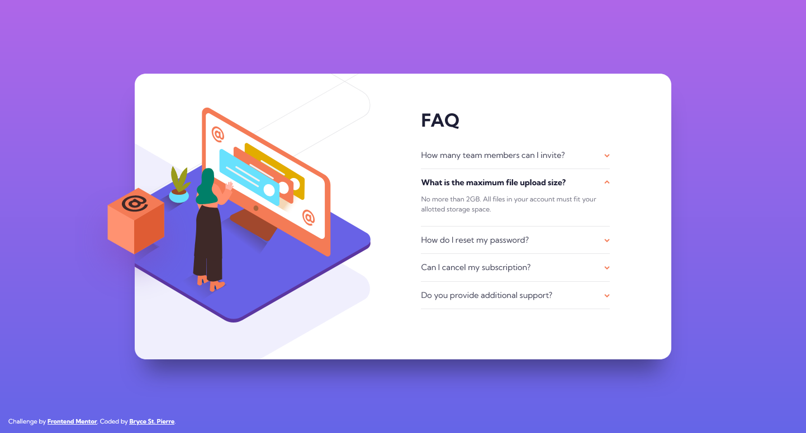

# Frontend Mentor - FAQ accordion card solution

This is a solution to the [FAQ accordion card challenge on Frontend Mentor](https://www.frontendmentor.io/challenges/faq-accordion-card-XlyjD0Oam). Frontend Mentor challenges help you improve your coding skills by building realistic projects. 

## Table of contents

- [Overview](#overview)
  - [The challenge](#the-challenge)
  - [Screenshot](#screenshot)
  - [Links](#links)
- [My process](#my-process)
  - [Built with](#built-with)
  - [What I learned](#what-i-learned)
  - [Useful resources](#useful-resources)
- [Author](#author)

## Overview

### The challenge

Users should be able to:

- View the optimal layout for the component depending on their device's screen size
- See hover states for all interactive elements on the page
- Hide/Show the answer to a question when the question is clicked
- **Bonus**: Complete the challenge without using JavaScript

### Screenshot

### Links

- Solution URL: [GitHub](https://github.com/BryceStPierre/fm-faq-accordion-card)
- Live Site URL: [Netlify](https://bsp-faq-accordion-card.netlify.app)

## My process

### Built with

- Semantic HTML5 markup
- Flexbox
- BEM naming conventions
- Mobile-first workflow

### What I learned

I remember reading online about an HTML5 element that accomplished an accordion without the need for JavaScript, so I researched this and came across the `
` and `
` tags.

### Useful resources

- [How to hide the default details ::marker](https://stackoverflow.com/questions/56758098/how-to-position-detail-marker-to-come-after-summary) - This helped me find the marker pseudo-selector, hide the default marker, and add my own dropdown arrow from the design. 

## Author

- Website - [Bryce St. Pierre](https://www.brycestpierre.com)
- Frontend Mentor - [@brycestpierre](https://www.frontendmentor.io/profile/brycestpierre)
- Twitter - [@BryceStPierre](https://www.twitter.com/BryceStPierre)
